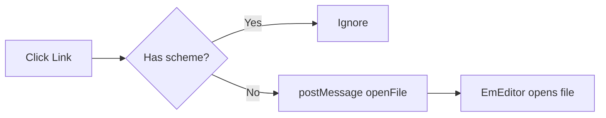

# Relative Link Test

This file tests clicking relative-path links to open files in EmEditor.

## Test Cases

### 1. Same directory
- [same-dir file](./target.md)

### 2. Parent directory
- [README](../README.md)

### 3. Subdirectory
- [docs spec](docs/spec.md)

### 4. Anchor (should scroll, NOT open file)
- [jump to bottom](#bottom-section)

### 5. External URL (should NOT be intercepted)
- [Google](https://www.google.com)
- [GitHub](http://github.com)

### 6. No prefix relative
- [target no dot](target.md)

---

## Mermaid (verify not broken)

---

## Bottom Section

You scrolled here via anchor link. It works!
